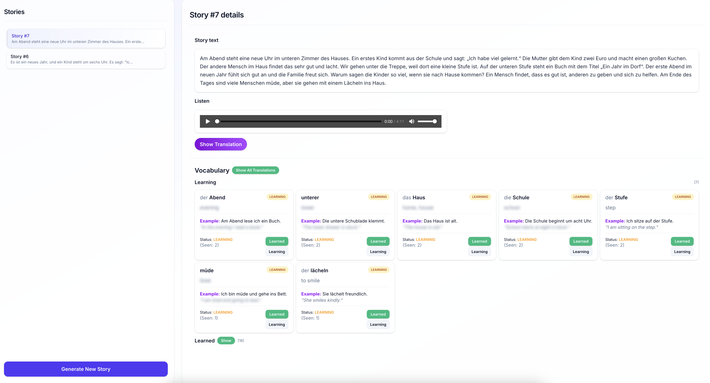
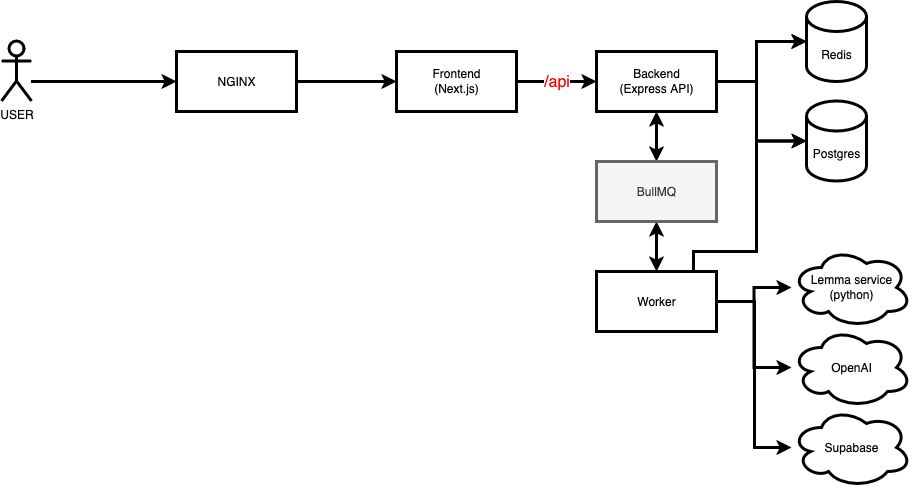

# Lingput - AI-Powered Comprehensible Input for Language Learning


**Lingput** is a full-stack, production-grade application that helps learners acquire a new language through **short, AI-generated stories**.
Unlike generic flashcard apps, Lingput adapts to your vocabulary and provides **natural comprehensible input**: stories, translations, audio, and smart word tracking

<p align="center">
  
</p>
<p align="center">
  
</p>

## Table of Contents

- [👩‍🎓 Use Cases](#-use-cases)
- [🛣 Roadmap](#-roadmap)
- [✨ Features](#-features)
- [🏗 Architecture](#-architecture)
- [🗂 Data Model](#-data-model)
- [🔌 API Overview](#-api-overview)
- [🚀 Getting Started (Dev)](#-getting-started-dev)
  - [1. Environment Variables](#1-environment-variables)
  - [2. Run with Docker Compose](#2-run-with-docker-compose)
- [🌐 Production](#-production)
- [🧑‍💻 Development Notes](#-development-notes)
- [🤝 Contributing](#-contributing)
- [📜 License](#-license)

## 👩‍🎓 Use Cases

**Who is this app for?**

- Language learners who want to acquire a new language through **immersive content** rather than dry flashcards.
- Users who want stories tailored to their **current vocabulary level**, so they can read and listen with confidence.
- Learners who need a simple way to **track, review, and master new words** over time.

## 🛣 Roadmap

✅ = Done · 🟦 = Planned

- ✅ Interactive onboarding
- 🟦 Audio downloading (export generated audio as MP3)
- 🟦 Word info on click (definitions, examples, grammar)
- 🟦 Detailed statistics (track number of learned words over time)
- 🟦 Gamification (XP, streaks, achievements)
- 🟦 Audio voice settings (choose between different TTS voices)
- 🟦 Leaderboard (compare progress with other learners)
- 🟦 Multi-language support (beyond current target language)

---

## ✨ Features

- 🔐 **Auth with secure cookies** - register/login with HTTP-only tokens, refresh flow included.
- 📊 **Vocabulary assessment** - quick test estimates your vocab size using a frequency list.
- 📚 **Personalized story generation** - AI generates stories with your known words (plus a few new).
- 🌍 **Chunked translation** - story is split into chunks with translations for easier comprehension.
- 🎧 **Audio generation** - full audio track (story + translations with pauses), stored in Supabase.
- 📝 **Smart word tracking** - The app doesn't just show translations, it saves words with examples and helps you track your progress.
- ⚡ **Background jobs** - BullMQ workers handle long-running tasks with progress updates.
- 🚀 **Caching** - Redis caches stories and word lists for fast responses.

---

## 🏗 Architecture

- Modern frontend: Next.js 15 (App Router), React, TailwindCSS
- Robust backend: Node.js + Express + Prisma + PostgreSQL
- Scalability: Redis + BullMQ for queues and background jobs
- DevOps: Docker Compose with NGINX reverse proxy
- AI/ML: OpenAI API for story generation and translation
- Cloud storage: Supabase for audio assets

<p align="center">
  
</p>

**High-level flow for story generation:**

1. User starts job → backend enqueues `generateStory` task (BullMQ).
2. Worker pipeline:

   - Fetch user vocabulary (Postgres)
   - Generate story (OpenAI)
   - Translate chunks (OpenAI)
   - Lemmatize + translate lemmas (lemma service (`apps/lemmas/`) + OpenAI)
   - Assemble audio (TTS + ffmpeg) -> upload to Supabase
   - Save the story to PostgreSQL

3. Frontend polls job status → displays story, audio, and unknown words.

---

## 🗂 Data Model

Prisma schema (`apps/backend/prisma/schema.prisma`) defines:

- **User**: email, password, relations
- **Story**: storyText, translationText, audioUrl, user
- **UnknownWord**: word, translation, article?, examples, timesSeen, status
- **UserVocabulary**: known words (`word`, `translation`, `article?`)
- **RefreshToken**: for JWT refresh rotation
- **WordRanking**: frequency list for vocab assessment

---

## 🔌 API Overview

Backend base: `/api`
Full API docs with request/response examples: [`apps/backend/API.md`](apps/backend/API.md)

**Main route groups:**

- `POST /auth/register` · `POST /auth/login` · `POST /auth/logout` · `POST /auth/refresh` · `GET /auth/me`
- `POST /story/generate` · `GET /story`
- `GET /vocab/words` · `POST /vocab/words` · `PATCH /vocab/words/:id` · `DELETE /vocab/words/:id`
- `GET /unknown-words/words` · `POST /unknown-words/mark-as-learned/:wordId`
- `GET /vocab-assessment/start` · `POST /vocab-assessment/answer`
- `GET /jobs/status/:jobId`

Auth uses HTTP-only cookies. Rate limiting + Helmet enabled.

---

## 🚀 Getting Started (Dev)

### 1. Environment Variables

You only need to create `.env` files for backend and frontend:

- `apps/backend/.env` (connection to Postgres and Redis is already configured in Docker Compose)

```env
OPENAI_API_KEY=sk-...
JWT_SECRET=replace-with-a-long-random-secret
SUPABASE_URL=https://YOUR_PROJECT_ID.supabase.co
SUPABASE_SERVICE_API_KEY=eyJ......
```

- `apps/frontend/.env`

```env
NEXT_PUBLIC_AUDIO_BUCKET_URL=https://YOUR_PROJECT_ID.supabase.co/storage/v1/object/public/YOUR_BUCKET/
```

---

### 2. Run with Docker Compose

```bash
docker compose -f docker-compose-dev.yml up --build
```

App: [http://localhost:3050](http://localhost:3050)

**Services launched:** Redis, Postgres, Lemma service, Backend, Worker, Frontend, NGINX.

| Service  | Port (host) |
| -------- | ----------- |
| NGINX    | 3050        |
| Backend  | 4000        |
| Postgres | 5432        |
| Redis    | 6379        |

---

## 🌐 Production

Use `docker-compose.yml` with prebuilt images:

- `markmdev/compinput-backend`
- `markmdev/compinput-worker`
- `markmdev/compinput-frontend`
- `markmdev/compinput-lemma`
- `markmdev/compinput-nginx`

Steps:

1. Build & push images to your registry.
2. Update image names in `docker-compose.yml`.
3. Provide production env vars (`OPENAI_API_KEY`, `SUPABASE_URL`, `SUPABASE_SERVICE_API_KEY`, `DATABASE_URL`, `REDIS_HOST`, `REDIS_PORT`, `JWT_SECRET`, etc).
4. Expose NGINX (`80` by default).

Cookies marked `Secure` automatically with `NODE_ENV=production`.

---

## 🧑‍💻 Development Notes

- Backend runs with `nodemon` in dev.
- Long tasks handled via BullMQ + worker (`apps/backend/src/worker.ts`).
- Job progress via `GET /api/jobs/status/:jobId`.
- Vocabulary assessment uses adaptive frequency-based loop.
- Redis caches stories (30m) & frequency lists (1d).
- Unknown words update queues invalidate story cache.

---

## 🤝 Contributing

Contributions welcome!

- Use **TypeScript strict mode** & meaningful names.
- Follow existing style (early returns, focused modules).

---

## 📜 License

Licensed under the [ISC License](./LICENSE).
